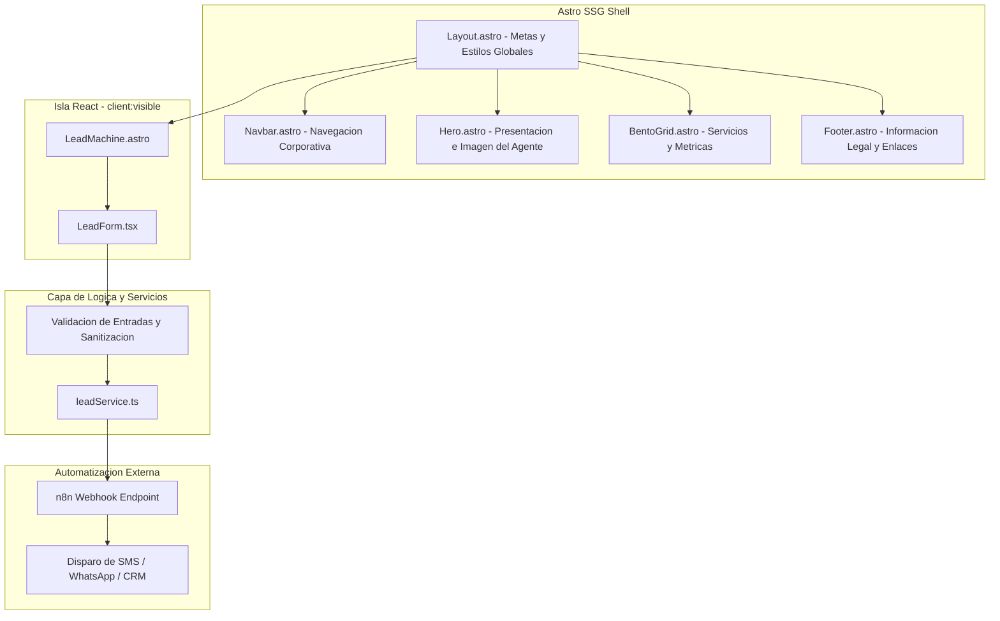

# Arquitectura del Sistema: Ravyn Seguros Demo

Este documento detalla los principios arquitectonicos, decisiones de diseno y separacion de responsabilidades del proyecto.

## 1. Vision General de la Arquitectura

La aplicacion utiliza el patron de arquitectura de islas (Islands Architecture) provisto por Astro. La mayor parte de la pagina es HTML y CSS puro generado en tiempo de compilacion (SSG), lo que garantiza tiempos de primer renderizado (FCP) cercanos a 0.1 segundos y optimizacion para motores de busqueda (SEO). 

Las secciones que requieren estado dinamico y reactividad del usuario (como el formulario de captura) se ejecutan de manera aislada mediante componentes React hidratados en el cliente solo cuando son visibles (`client:visible`).

## 2. Separacion de Responsabilidades (Separation of Concerns)

1. **Capa de Presentacion Estatica (Astro):**
   - Responsable de la semantica HTML, accesibilidad y maquetacion estructural.
   - Proporciona maximo rendimiento sin JavaScript innecesario en el hilo principal del navegador.

2. **Capa Interactiva (React):**
   - Responsable del estado de la interfaz de usuario en el formulario (`idle`, `loading`, `success`, `error`).
   - Controla validaciones en tiempo real (formato de correo electronico, codigo postal de EE. UU. de 5 digitos).

3. **Capa de Servicios (`src/services/leadService.ts`):**
   - Desacoplada de los componentes visuales.
   - Se encarga de la comunicacion HTTP con el webhook de n8n, manejo de timeouts de red y mecanismo de contingencia (fallback/mock) para demostraciones cuando no se ha configurado un endpoint real.

## 3. Decisiones de Diseno Editorial y Eliminacion de "IA Slop"

Basado en la referencia de diseno editorial de alta gama:
- **Estructura en Bloques Contenidos (`rounded-[36px]`):** En lugar de bandas genericas de pantalla completa, cada seccion es un modulo visual independiente con esquinas curvas pronunciadas sobre un lienzo neutro (`#ECEEF2`).
- **Titulares Tipograficos con Pildoras Solidas:** Las palabras clave se enmarcan en capsulas de color solido para orientar el foco visual (ej. `[ IN 2025 ]`), suprimiendo degradados de texto arcoiris artificiales.
- **Iconografia Funcional y Flechas Diagonales:** Las tarjetas Bento incorporan flechas angulares de accion (`↗`) en la esquina superior y una tarjeta con acento solido, imitando la direccion de arte de publicaciones impresas y Behance contemporaneo.
- **Cero Artefactos de IA ("AI Slop"):**
  - Cero puntos parpadeantes (`animate-pulse`) o estados falsos (*"🟢 STATUS: ACTIVE"*).
  - Cero esferas de desenfoque de fondo genericas (*blur-3xl glow balls*).
  - Cero badges flotantes desalineados o widgets intrusivos de chatbot.
  - Cero emojis en codigo, comentarios y capa de presentacion.

## 4. Manejo de Errores y Robustez

- **Timeout de Red:** Toda peticion saliente al webhook incluye un limite de tiempo de espera (5 segundos) para evitar bloqueos en la interfaz.
- **Modo Demo Resiliente:** Si el endpoint de n8n no esta configurado o no responde, el servicio conmuta de manera transparente a una simulacion de exito con retraso realista de 1 segundo, garantizando que el agente pueda presentar la demostracion comercial sin fallos frente a clientes.
